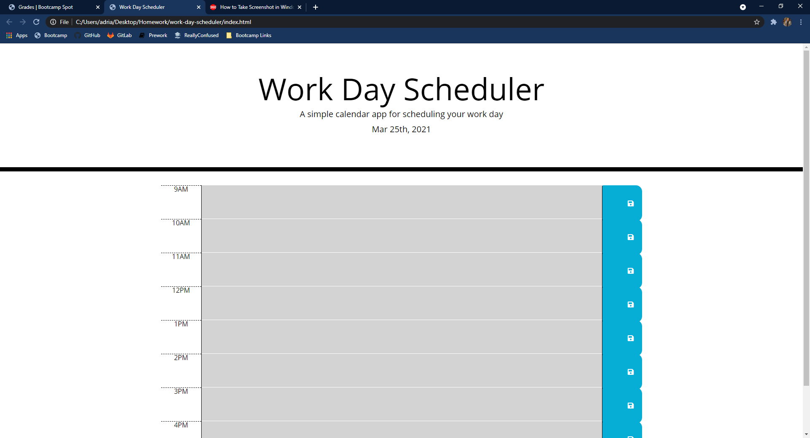
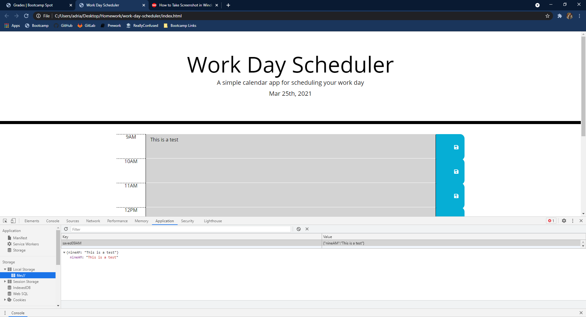
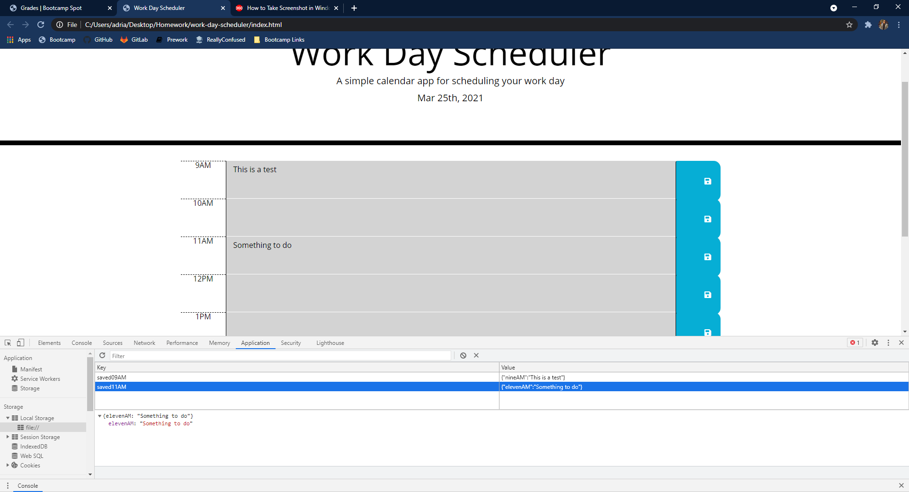
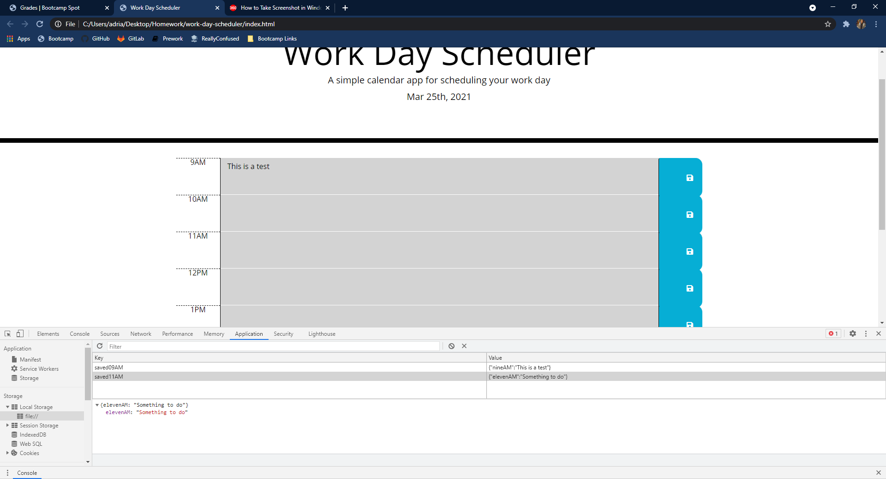
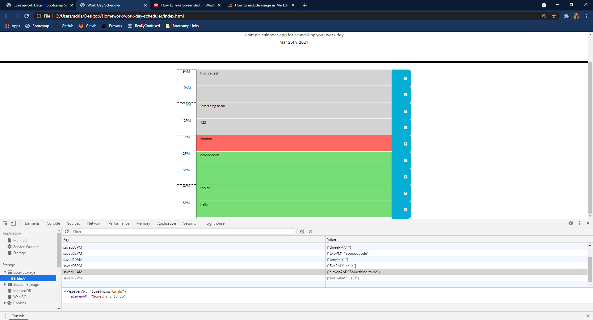

The time blocks will change depending on the time that the page is being viewed. Gray colored boxes are those in the past, a red box shows the current time block, and a green box show time blocks that are still in the future.

This website will store information from users who have previously visited this page and saved something to their schedule. Notes will be saved and displayed on refresh when there something save in each time block.

If there is nothing inside of a text box, then the next text box wont display its contents. This is fixed by saving either nothing for the previous box but this is an issue that still needs to be worked out.

This is what the site looks like with something filled out for every box, and the time set to 1PM.

--todo--
fix text fields not displaying unless there is an entry in the previous hour block
maybe something to do with the save button? i remember some work needed to be done on that but not sure atm
