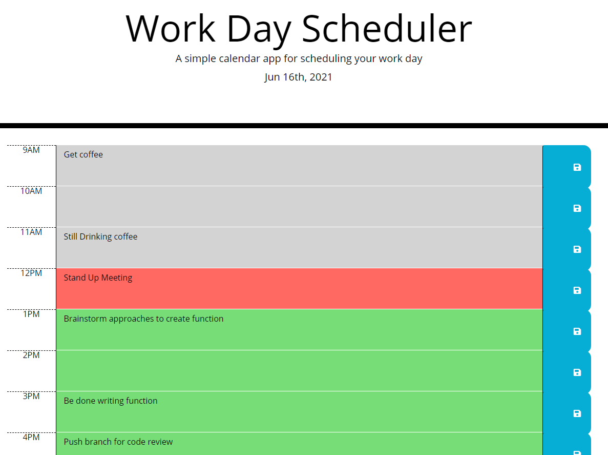
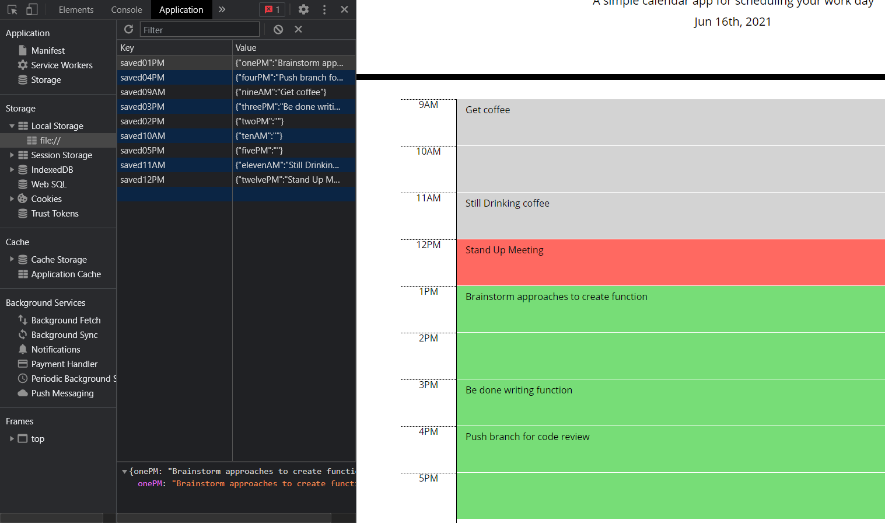

# Work Day Scheduler

## Description

This project allows a user to create a schedule for their day using time blocks to save their tasks. Using local storage, this schedule will persist the next time the user comes back to the page.

 

## Usage

The way to use this project is to create a list of tasks that you would like to accomplish during the day. When the hour of the task is in the future, then that box will be green to show you still have time to do it. If the hour of the task is the present hour, than it will be colored red to indicate that it should be completed soon. If the hour of the task is a past hour, then is will be colored gray to indicate that it the hour has passed and that task should be completed.

 

 

## Test

If you'd like to test this project you can clone it from my GitHub profile, then opening up the index.html page in the browser will allow you to test the app. Changing

    var currentHour = moment().format("HH");

to a number between 8 and 17 to see the how the time blocks change color depending on what hour it is.

Opening up the Application tab in the browser and looking at the local storage, you should see keys for 9AM through 5PM with empty values. Typing into the boxes and clicking its respective save button will change these values and they will persist the next time a user returns to the page as well.

 

 

## Contact Information

Github: https://github.com/amata7

LinkedIn: www.linkedin.com/in/amata7

Email : mata-adrian@outlook.com
